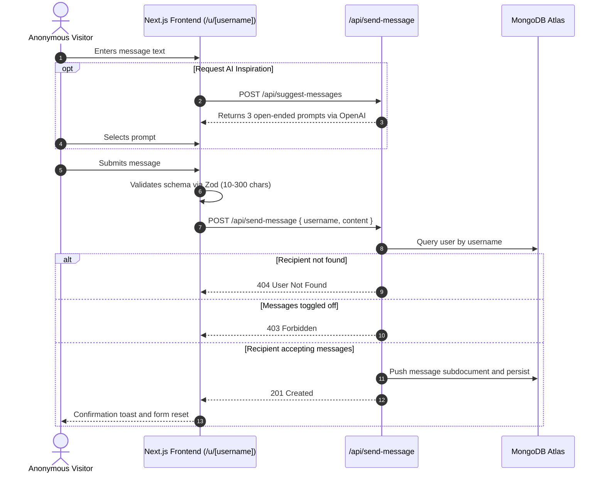
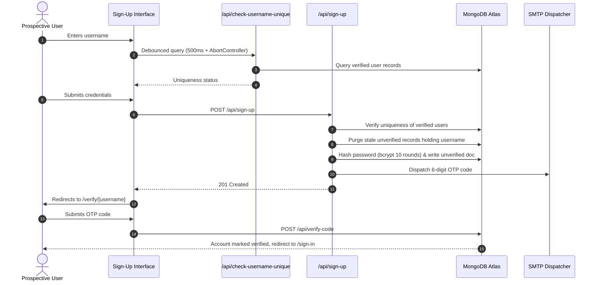
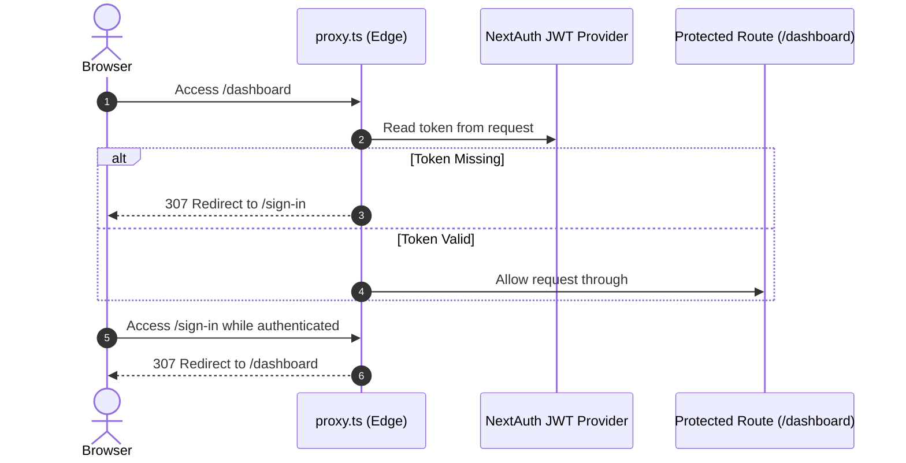

# Mystery Message

Full-stack anonymous feedback platform built with Next.js 16 (App Router), React 19, TypeScript, Tailwind CSS v4, MongoDB Atlas, NextAuth.js, and OpenAI.

---

## Table of Contents

- [Overview](#overview)
- [Architecture & Data Flow](#architecture--data-flow)
  - [Message Ingestion](#message-ingestion)
  - [Account Registration & Verification](#account-registration--verification)
  - [Edge Route Protection](#edge-route-protection)
- [Core Engineering Decisions](#core-engineering-decisions)
  - [Database Aggregation vs. In-Memory Manipulation](#database-aggregation-vs-in-memory-manipulation)
  - [Network & DNS Resilience](#network--dns-resilience)
  - [Race-Condition Mitigation on Real-Time Checks](#race-condition-mitigation-on-real-time-checks)
  - [Stale Registration Lifecycle Handling](#stale-registration-lifecycle-handling)
  - [Type Augmentation for Auth Sessions](#type-augmentation-for-auth-sessions)
- [Security & Threat Mitigation](#security--threat-mitigation)
- [Performance & Scalability Architecture](#performance--scalability-architecture)
- [Error Handling & Reliability Standards](#error-handling--reliability-standards)
- [Features](#features)
- [Tech Stack](#tech-stack)
- [API Specification](#api-specification)
- [Local Setup](#local-setup)
- [Environment Variables](#environment-variables)
- [Production Deployment](#production-deployment)

---

## Overview

Mystery Message enables users to receive candid questions and feedback through a dedicated public profile link (`/u/[username]`). Senders can submit messages anonymously without authentication or identity logging. Account owners access a private dashboard to review, delete, and control message ingestion in real time.

The project is structured around production engineering patterns: edge route verification, database-level aggregation, resilient DNS lookups, type-inferred validation schemas, and delimiter-based LLM generation.

---

## Architecture & Data Flow

### Message Ingestion



### Account Registration & Verification



### Edge Route Protection



---

## Core Engineering Decisions

### Database Aggregation vs. In-Memory Manipulation
Retrieving and ordering nested messages inside Node.js memory leads to high heap allocation and performance degradation as user histories grow. The message retrieval endpoint offloads all filtering, unwinding, and sorting to the database engine using an aggregation pipeline:

```typescript
const user = await UserModel.aggregate([
  { $match: { _id: userId } },
  { $unwind: "$messages" },
  { $sort: { "messages.createdAt": -1 } },
  { $group: { _id: "$_id", messages: { $push: "$messages" } } },
]).exec();
```

Message deletions use the atomic `$pull` operator:

```typescript
await UserModel.updateOne(
  { _id: userId },
  { $pull: { messages: { _id: messageId } } }
);
```

This prevents fetching the parent document into memory and eliminates full-document write operations.

### Network & DNS Resilience
Serverless deployments and local Windows networks frequently experience `querySrv ECONNREFUSED` when resolving MongoDB Atlas SRV connection strings, or `queryA ETIMEOUT` during SMTP handshakes.

To guarantee connection reliability:
- Custom DNS resolvers override local ISP endpoints with public Google (`8.8.8.8`) and Cloudflare (`1.1.1.1`) nameservers.
- SMTP hostname resolution falls back to known Google SMTP IPs if DNS fails.
- In local development mode, generated OTPs print directly to stdout so registration flows remain testable without third-party email delivery.

### Race-Condition Mitigation on Real-Time Checks
Rapid keystrokes during username verification can trigger out-of-order network responses, where a slow response for a previous input overwrites a newer response.

The implementation combines:
1. A **500ms debounce** window.
2. An **AbortController** signal to cancel in-flight requests when input changes.
3. A `useRef` cache key to prevent duplicate round trips when users erase and re-type identical values.

### Stale Registration Lifecycle Handling
Standard unique index constraints create collisions when users register but fail to complete OTP verification, permanently locking the chosen username.

The sign-up handler explicitly manages unverified records:
- Queries only `isVerified: true` records when evaluating username ownership.
- Cleans up unverified duplicate records before binding credentials to a new user.
- Allows existing unverified users to re-submit registration and receive a refreshed verification code without database conflict.

### Type Augmentation for Auth Sessions
NextAuth default types do not include custom database fields (`_id`, `username`, `isVerified`, `isAcceptingMessage`). TypeScript module augmentation extends `DefaultSession` and `JWT` interfaces:

```typescript
declare module "next-auth" {
  interface User {
    _id?: string;
    username?: string;
    isVerified?: boolean;
    isAcceptingMessage?: boolean;
  }
}
```

This maintains strict compiler safety across client hooks and server route handlers.

---

## Security & Threat Mitigation

- **Zero-Knowledge Anonymity Model**: Submitted messages persist strictly `{ content, createdAt }`. Senders are never prompted for credentials, and no IP addresses, user agents, headers, or persistent cookies are captured.
- **NoSQL Injection Defense**: Dynamic queries are strongly bounded using Zod schemas before touching Mongoose models. Inputs are stripped of unexpected operator keys, preventing query selector injection.
- **Timing-Safe Password Authentication**: Credential evaluation relies on `bcrypt.compare` to maintain constant-time execution, mitigating side-channel timing analysis attacks on user passwords.
- **Edge-Level Route Interception**: Authentication validation occurs within `proxy.ts` at the network edge. Unauthenticated requests to `/dashboard` are intercepted before the server component render pipeline executes.
- **Stateless JWT Session Management**: Authentication tokens are stored in secure HTTP-only cookies with JWT signing, eliminating state synchronization bottlenecks across serverless lambdas.

---

## Performance & Scalability Architecture

- **Engine-Level Query Processing**: Aggregations execute directly within MongoDB's native query engine, offloading memory sorting and maintaining flat $O(1)$ memory consumption on the Node.js application process.
- **Atomic Array Mutations**: Subdocument removal uses MongoDB `$pull` operators rather than reading, splicing, and saving full user trees, eliminating document lock contention.
- **Serverless Connection Pooling**: MongoDB connections are cached on `global.mongooseCache`. This preserves open connection pools across serverless function re-invocations and avoids connection pool exhaustion.
- **Index Optimization**: Single-field unique indexes on `username` and `email` ensure $O(\log N)$ point lookups across authentication and registration endpoints.
- **Client Bandwidth Conservation**: The username validation pipeline couples debouncing with native `AbortController` cancellation, terminating pending requests when users continue typing.

---

## Error Handling & Reliability Standards

- **Uniform Response Schema**: All 9 API route handlers adhere to the standardized `ApiResponse` TypeScript contract (`{ success: boolean; message: string; ... }`), ensuring predictable deserialization across the frontend.
- **Multi-Tier DNS Fallback**: Protects database handshakes against ISP SRV resolution drops by injecting public Google (`8.8.8.8`) and Cloudflare (`1.1.1.1`) DNS servers prior to Mongoose connection attempts.
- **Resilient Email Dispatch**: SMTP transport uses independent host resolution with fallback to pre-mapped Google SMTP clusters if local network lookups fail.
- **Zero-Blocker Local DX**: Verification OTPs print directly to the server terminal console during development, allowing full test coverage even without active email credentials.

---

## Features

- **Anonymous Message Ingestion**: Submit feedback to `/u/[username]` with no login required and no sender footprint.
- **Message Acceptance Toggle**: Toggle message ingestion on or off from the user dashboard.
- **AI-Assisted Suggestions**: Generate open-ended questions using OpenAI (`gpt-3.5-turbo`) with single-click form insertion.
- **Debounced Availability Checks**: Live username checking with request cancellation and visual status feedback.
- **OTP Verification Flow**: 6-digit email confirmation code with a 1-hour expiration window.
- **Edge Route Guards**: Next.js 16 `proxy.ts` middleware preventing unauthorized access to protected routes.
- **Interactive UI**: Responsive dark theme built with Tailwind CSS v4, Lucide icons, and Embla Carousel with autoplay.

---

## Tech Stack

| Layer | Technology | Role |
| :--- | :--- | :--- |
| Framework | Next.js 16 (App Router) | Server components, route handlers, edge proxy |
| Client | React 19, TypeScript 5 | UI rendering, type enforcement |
| Styling | Tailwind CSS v4 | Utility-first stylesheet |
| Database | MongoDB Atlas, Mongoose 9 | Document storage, aggregation pipelines |
| Auth | NextAuth.js v4 | Credentials provider, JWT session storage |
| Validation | Zod 3, React Hook Form | Shared client and server validation schemas |
| Email | Nodemailer 7, Resend | SMTP dispatch with fallback resolution |
| AI | OpenAI SDK (`gpt-3.5-turbo`) | Contextual question generation |
| Carousel | Embla Carousel React | Hardware-accelerated sliding showcases |

---

## API Specification

| Method | Endpoint | Description | Payload | Auth |
| :--- | :--- | :--- | :--- | :---: |
| `POST` | `/api/sign-up` | Registers account and dispatches OTP | `{ username, email, password }` | No |
| `POST` | `/api/verify-code` | Validates 6-digit verification code | `{ username, code }` | No |
| `GET` | `/api/check-username-unique` | Validates username availability | `?username=string` | No |
| `POST` | `/api/send-message` | Ingests anonymous message | `{ username, content }` | No |
| `POST` | `/api/suggest-messages` | Generates AI prompt suggestions | None | No |
| `GET` | `/api/get-messages` | Retrieves ordered user messages | None | Yes |
| `DELETE` | `/api/delete-message/[id]` | Removes message by subdocument ID | URL Parameter | Yes |
| `GET` | `/api/accept-messages` | Reads message acceptance status | None | Yes |
| `POST` | `/api/accept-messages` | Updates message acceptance status | `{ acceptMessages: boolean }` | Yes |

---

## Local Setup

### Prerequisites
- Node.js 18.18+ or later
- MongoDB Atlas cluster URI or local MongoDB instance
- Git

### Installation
```bash
git clone https://github.com/7gautamkumawat7/Mystery-Message.git
cd Mystery-Message/my-app
npm install
```

### Environment Configuration
Copy the sample environment file:
```bash
cp .env.example .env
```

Populate `.env` with your credentials:
```env
MONGODB_URI=mongodb+srv://<user>:<password>@<cluster>.mongodb.net/<database>?retryWrites=true&w=majority
NEXTAUTH_SECRET=your_nextauth_secret
NEXTAUTH_URL=http://localhost:3000
EMAIL_USER=your_email@gmail.com
EMAIL_PASS=your_google_app_password
OPENAI_API_KEY=your_openai_api_key
```

### Run Application
```bash
# Development
npm run dev

# Production Build
npm run build
npm run start

# Code Quality
npm run lint
```

Open [http://localhost:3000](http://localhost:3000) to view the application.

---

## Environment Variables

| Variable | Required | Description |
| :--- | :---: | :--- |
| `MONGODB_URI` | Yes | MongoDB Atlas or local connection string |
| `NEXTAUTH_SECRET` | Yes | Secret string used for signing JWT auth tokens |
| `NEXTAUTH_URL` | Yes | Canonical application base URL (`http://localhost:3000`) |
| `EMAIL_USER` | Optional | Gmail address for SMTP authentication |
| `EMAIL_PASS` | Optional | 16-character Google App Password |
| `OPENAI_API_KEY` | Optional | API key for generating AI questions |
| `RESEND_API_KEY` | Optional | Alternative email provider key |

---

## Production Deployment

### Vercel Deployment
1. Import repository to Vercel.
2. Configure environment variables in the project settings (`MONGODB_URI`, `NEXTAUTH_SECRET`, `NEXTAUTH_URL`, `EMAIL_USER`, `EMAIL_PASS`, `OPENAI_API_KEY`).
3. Set the build command to `npm run build` and output directory to default.
4. Deploy with automatic edge proxy optimizations.

### Self-Hosted / Node.js Production
1. Build the production bundle:
   ```bash
   npm run build
   ```
2. Start the production server:
   ```bash
   npm run start
   ```
3. Run behind a reverse proxy (e.g., NGINX) with SSL termination and appropriate forwarding headers (`x-forwarded-for`, `x-forwarded-proto`).
